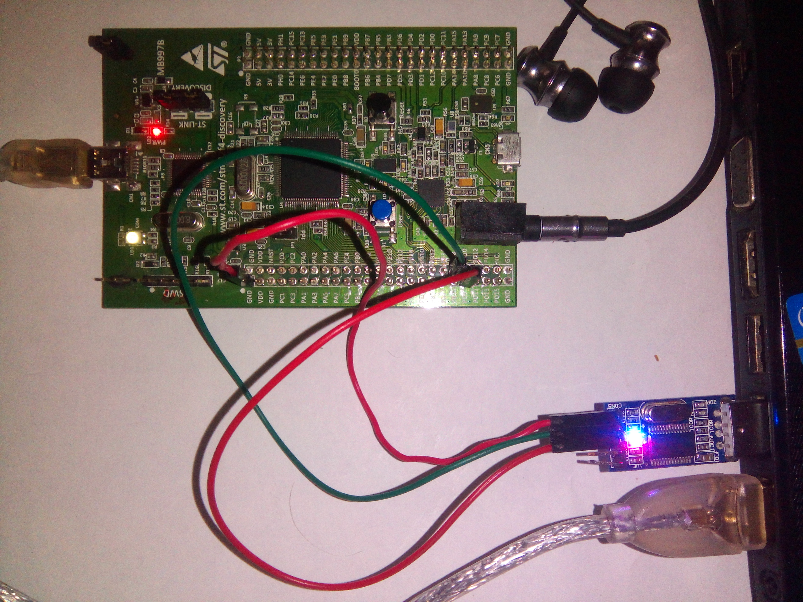

.. _theCore_stm32f4_cs43l22:

STM32F4 discovery audio example with CS43L22 audio DAC
------------------------------------------------------

:Location:          ``examples/cs43l22_audio``
:Target:            STM32F4 Discovery board
:External HW:       UART-to-USB converter attached to the USART3, headphones
:Toolchain:         GNU arm-none-eabi v.5.2 or newer
:Additional SW:     openocd, minicom

Wiring
~~~~~~

#. Attach any preferable UART-to-USB converter `such as this`_ module according to following pinout:

   +-------------------+-----------------+
   | PD8 (USART3 TX)   | module's RX     |
   +-------------------+-----------------+
   | PD9 (USART3 RX)   | module's TX     |
   +-------------------+-----------------+
   | GND               | module's GND    |
   +-------------------+-----------------+

Building
~~~~~~~~

#. Complete :ref:`theCore_examples_initial_setup` section.
#. Execute build commands.
   The CMake Toolchain file is required to build this application.
   theCore already has one suitable for this target.

   ::

     cd examples/cs43l22_audio
     mkdir build
     cd build
     cmake -DCMAKE_TOOLCHAIN_FILE=../../../toolchains/arm-cm4-gnu.cmake ..
     make

Running
~~~~~~~

Firmware will be flashed via ``openocd`` and ``gdb``.

#. Connect stm32f4 Discovery board to USB cable and connect USB <-> UART converter to the PC.
#. Launch ``openocd`` in the separate terminal using script provided by theCore.
   Alternatively, you can use script from openocd installation.

   ::

     # From new terminal
     cd path/to/theCore
     openocd -f ./scripts/stm32f4discovery.cfg

#. Launch ``minicom`` with device associated with USB <-> UART converter.
   (``/dev/ttyUSB0`` here used as an example)::

     # From new terminal
     minicom -D /dev/ttyUSB0

#. Provided that your main terminal's current directory is ``build``,
   launch ``gdb``::

     # From the build directory
     arm-none-eabi-gdb audio

#. Under GDB shell, connect to ``openocd`` and flash firmware::

     (gdb) target remote :3333
     Remote debugging using :3333
     0x00000000 in ?? ()

     (gdb) monitor reset halt
     target state: halted
     target halted due to debug-request, current mode: Thread
     xPSR: 0x01000000 pc: 0x08000188 msp: 0x20020000

     (gdb) load
     Loading section .text, size 0x4724 lma 0x8000000
     Loading section .init_array, size 0xc lma 0x8004724
     Loading section .rodata, size 0x228 lma 0x8004730
     Loading section .data, size 0x24 lma 0x8004958
     Start address 0x8000188, load size 18812
     Transfer rate: 14 KB/sec, 3762 bytes/write.

#. Start new firmware::

     (gdb) continue
     Continuing.

#. Attach headphones to the audio jack on Discovery board.

Expected output
~~~~~~~~~~~~~~~

In ``minicom`` you should be able to see::

  Welcome to theCore
  Playing audio sample...

In headphones you should hear cool 8-bit sound.

Target JSON config for the audio example
~~~~~~~~~~~~~~~~~~~~~~~~~~~~~~~~~~~~~~~~

.. literalinclude:: ../../../../examples/cs43l22_audio/stm32f4_cs43l22.json

.. _such as this: http://www.geekfactory.mx/wp-content/uploads/2013/06/converdidor_usb_ttl_rs232_pl_2303hx_01.jpg
