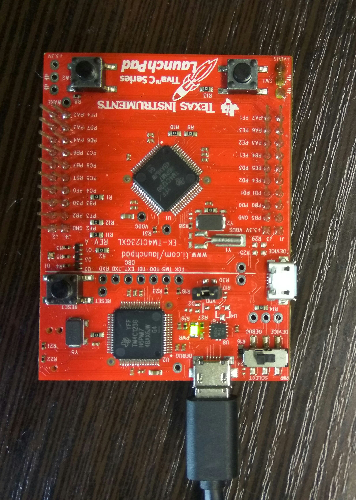

# theCore _TM4C_ _LED_ example

 ```

 target:            Tiva C Series TM4C123G LaunchPadEvaluation Board
 external HW:       none
 toolchain:         GNU arm-none-eabi v.5.2 or greather
 additional SW:     UniFlash
 ```
## Wiring

No special wiring is required. Just connect the board to the powered USB port.



## Building

Toolchain is required to build this application. theCore already has one suitable
for this target.

```
mkdir build
cd build
cmake -DCMAKE_TOOLCHAIN_FILE=../../toolchains/arm-cm4-gnu.cmake ..
```

## Running

Flash firmware via [`UniFlash`](http://processors.wiki.ti.com/index.php/Category:CCS_UniFlash). The `UniFlash` interface is straightforward.

## Expected output

In console:
```
Welcome to theCore
Starting TM4C led demo...
```

On board led is blinking with the different (RGB) colors.
